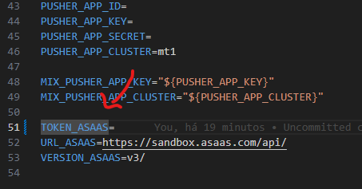

# Teste ASAAS
Aplicação em laravel de um sistema de processamento de pagamentos integrado
ao ambiente de homologação do ASAAS

## Comando para buildar o projeto
`docker compose up  -d --build`

## Comando para criar as tabelas do banco de dados
`php artisan migrate`

## Comando para instalar as dependências do projeto
Acesse o container "laravel-asaas", no meu caso acessei via Programa "Docker Desktop" como a imagem abaixo, e digite o comando `composer install --dev`


## Dados de Acesso ao Banco de Dados local
```
Host: localhost
User: root
Password: 'root'
DataBase: asaas
Port: 3306
```

## Token de acesso ASAAS
Insira o seu token de acesso ao ambiente de homologação da ASAAS na variável `TOKEN_ASAAS` no arquivo `.env` na raís do projeto, como na imagem abaixo



## Link de acesso da aplicação local
```url
http://localhost/
```

## PRINTS da aplicação e passo a passo de como testar
- Cadastre um produto
- Acesse o produto cadastrado no botão "Comprar"
- Insira os dados do cliente e escolha uma forma de pagamento, caso escolha "CARTÃO DE CRÉDITO" segue abaixo dados de um cartão testes
```
Número do cartão: 1234567890123456
Validade do cartão: 08/2027
CVV do cartão: 123
```


